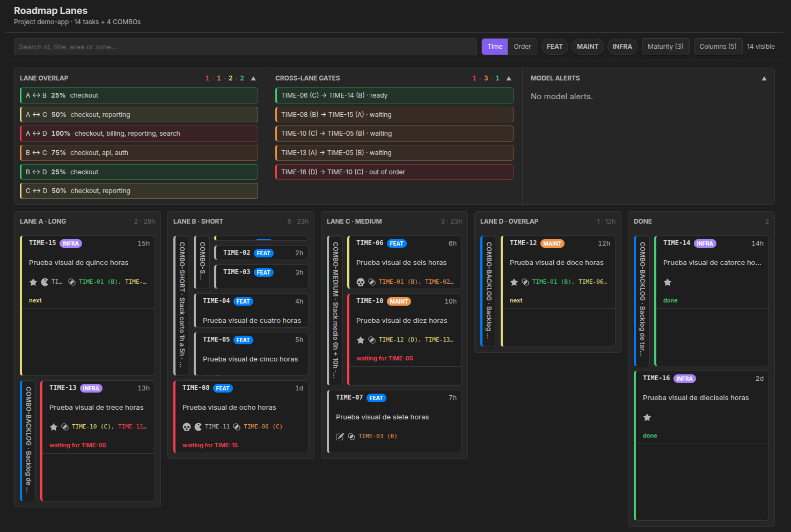

# Roadmap Lanes

> [🇬🇧 English](README.md) · 🇪🇸 Español

Un tablero de roadmap para Obsidian. Cada tarea es una nota markdown; el tablero las dibuja como
**carriles de trabajo en paralelo**, usando el **tiempo estimado como altura** de cada tarjeta (un
Gantt vertical) y mostrando dónde se **pisan** los carriles. El estado es un *campo*, no una carpeta.
Sin build ni base de datos — lee el *frontmatter* de tus notas vía el índice nativo de Obsidian, así
que el tablero se actualiza a medida que editás.



## Qué hace

- Una tarea = una nota `.md` con un frontmatter chico (`type`, `maturity`, `status`, `duration`,
  `zones`, `depends_on`, …).
- El tablero **deriva** todo: orden de carriles, tiempo-como-altura, **solape entre carriles** (tareas
  de carriles distintos que tocan la misma zona), **dependencias cruzadas** (gates entre carriles) y
  **alertas del modelo** (inconsistencias de datos).
- No hay nada que mantener a mano: agregás o editás una nota y el tablero lo refleja.

## Instalación

En Obsidian: **Ajustes → Plugins de la comunidad → Explorar → "Roadmap Lanes" → Instalar → Activar**.

Manual: copiá `main.js`, `manifest.json` y `styles.css` en
`<vault>/.obsidian/plugins/roadmap-lanes/`.

## Inicio rápido

1. El plugin crea una carpeta `roadmap/` en tu vault (con `lanes.yaml` y `taxonomy.yaml`).
2. Agregá una nota de tarea dentro de `roadmap/`:
   ```yaml
   ---
   id: FT-001
   title: Página de checkout
   type: feat
   maturity: ready
   status: pending
   duration: 8        # horas
   zones: [checkout]
   ---
   ```
3. Abrí el tablero: comando **"Abrir tablero de carriles"** o el icono de la barra lateral.
4. Para poner tareas en un carril, listá su `id` en `roadmap/lanes.yaml`.

El proceso completo está en la [guía de flujo de trabajo](docs/guides.es/FLUJO_DE_TRABAJO.md).

## Funciones

- **Tiempo-como-altura (Gantt) ↔ modo orden** — un switch: la altura = duración, o todas las tarjetas
  iguales para leer solo el orden.
- **Solape entre carriles** y **dependencias cruzadas**, coloreados por severidad.
- **Alertas del modelo** (referencias rotas, ids duplicados, valores inválidos…), que se pueden aceptar.
- **Validador CLI** para agentes y hooks: corre las mismas alertas del modelo fuera de Obsidian.
- **Panel de detalle**, **filtros** (texto / tipo / madurez / columnas) y secciones de coordinación
  **colapsables**.
- Convive con el **grafo** nativo y con **Bases** sobre el mismo frontmatter.

## Configuración

| Setting | Qué hace |
|---|---|
| **Carpeta del roadmap** | Carpeta donde RL guarda `lanes.yaml`, `taxonomy.yaml` y las notas de tareas. |
| **Duración de la jornada** | Horas por día; convierte `duration` (horas) a días para el display y la altura. |
| **Tipos compactos** | Muestra el tipo como un punto de color en vez de un chip con texto — ahorra ancho en columnas angostas. |
| **Resaltar tareas en espera** | Atenúa el borde izquierdo de todas las tareas salvo las que esperan a otra, que van al color primario. |

## Guías

- [Flujo de trabajo](docs/guides.es/FLUJO_DE_TRABAJO.md) — cómo descubrir, documentar y ejecutar el trabajo.
- [Leyenda del tablero](docs/guides.es/LEYENDA_DEL_TABLERO.md) — qué significa cada color, ícono y señal.
- [Visualización](docs/guides.es/VISUALIZACION.md) — el grafo nativo y Bases sobre los mismos datos.

## Diseño

El modelo de datos y su razonamiento viven en [`docs/VISION.es.md`](docs/VISION.es.md) — para los curiosos y
para contribuidores.

## Desarrollo

```sh
npm install
npm run dev     # compila main.ts -> main.js y validate.ts -> validate.js en modo watch
npm run build   # build de producción
```

Enlazá el repo (symlink) en `<vault>/.obsidian/plugins/roadmap-lanes/` para probarlo en vivo en un vault.

Después de `npm run build`, validá una carpeta roadmap desde la terminal:

```sh
node validate.js <vault>/roadmap --report --strict
```

Usá `--json` para tooling y `--lang es` para mensajes en castellano.
